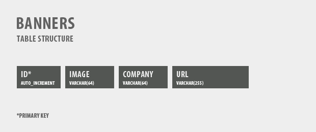

## Write HTML codes for displaying image and demonstrate hyper linking


## Code

### index.html


```html
<!DOCTYPE html>
<html>
  <head>
    <title>Image and Hyperlink Demo</title>
  </head>
  <body>
    <!-- Displaying an Image -->
    

    <!-- Creating a Hyperlink -->
    <p>
      Click <a href="https://www.example.com" target="_blank">here</a> to visit
      Example.com
    </p>
  </body>
</html>


```

## Output

