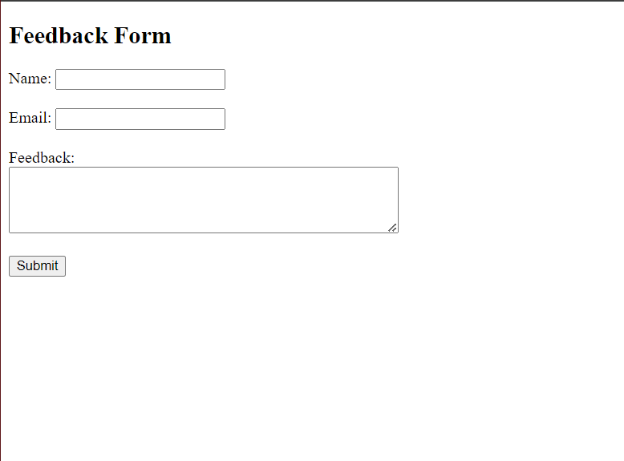

## Create a Feedback Form Using Form handling


## Code

### index.html


```html

<!DOCTYPE html>
<html>
  <head>
    <title>Feedback Form</title>
  </head>
  <body>
    <h2>Feedback Form</h2>
    <form action="process_feedback.php" method="post">
      <label for="name">Name:</label>
      <input type="text" name="name" required /><br /><br />

      <label for="email">Email:</label>
      <input type="email" name="email" required /><br /><br />

      <label for="feedback">Feedback:</label><br />
      <textarea name="feedback" rows="4" cols="50" required></textarea
      ><br /><br />

      <input type="submit" value="Submit" />
    </form>
  </body>
</html>


```


### process_feedback.php


```php

<?php
if ($_SERVER["REQUEST_METHOD"] == "POST") {
    $name = $_POST["name"];
    $email = $_POST["email"];
    $feedback = $_POST["feedback"];

    // Process the feedback (you can save it to a database or send it via email)

    echo "Thank you, $name, for your feedback!<br>";
    echo "Email: $email<br>";
    echo "Feedback: $feedback<br>";
}
?>


```

## Output

