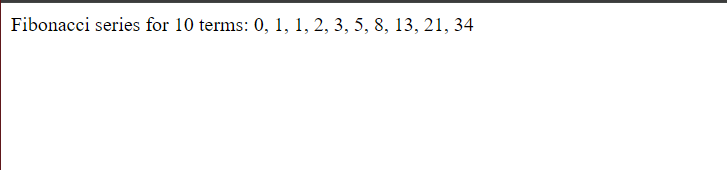

## Write PHP Script to print Fibonacci series.


## Code

### index.php


```php

<?php

function fibonacci($n) {
    $fib = [0, 1]; 

    for ($i = 2; $i < $n; $i++) {
        
        $fib[$i] = $fib[$i - 1] + $fib[$i - 2];
    }

    return $fib;
}


$num = 10;


echo "Fibonacci series for $num num: ";
echo implode(", ", fibonacci($num));
?>


```

## Output

