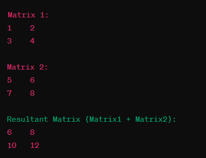

##  Write PHP Script using two dimensional arrays such as addition of two 2×2 matrices


## Code

### index.php


```php
<?php

function addMatrices($matrix1, $matrix2) {
    $result = array();

    
    for ($i = 0; $i < 2; $i++) {
        for ($j = 0; $j < 2; $j++) {
            $result[$i][$j] = $matrix1[$i][$j] + $matrix2[$i][$j];
        }
    }

    return $result;
}


$matrix1 = array(array(1, 2), array(3, 4));
$matrix2 = array(array(5, 6), array(7, 8));


$resultMatrix = addMatrices($matrix1, $matrix2);


echo "Matrix 1:\n";
printMatrix($matrix1);

echo "Matrix 2:\n";
printMatrix($matrix2);

echo "Resultant Matrix (Matrix1 + Matrix2):\n";
printMatrix($resultMatrix);


function printMatrix($matrix) {
    foreach ($matrix as $row) {
        echo implode("\t", $row) . "\n";
    }
    echo "\n";
}
?>


```

## Output

