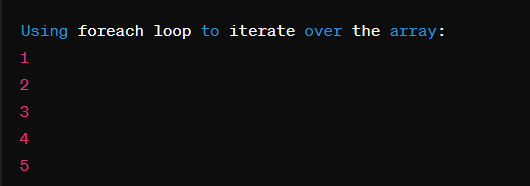

##  Write PHP Script for FOR EACH loop execution.


## Code

### index.php


```php

<?php

$numbers = array(1, 2, 3, 4, 5);


echo "Using foreach loop to iterate over the array: </br>";
foreach ($numbers as $number) {
    echo $number . "</br>";
}
?>


```

## Output

