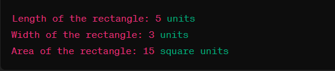

##  Write PHP script Using user defined function.


## Code

### index.php


```php
<?php

function calculateRectangleArea($length, $width) {
    $area = $length * $width;
    return $area;
}


$length = 5;
$width = 3;


echo "Length of the rectangle: $length units</br>";
echo "Width of the rectangle: $width units</br>";
echo "Area of the rectangle: " . calculateRectangleArea($length, $width) . " square units</br>";
?>


```

## Output

