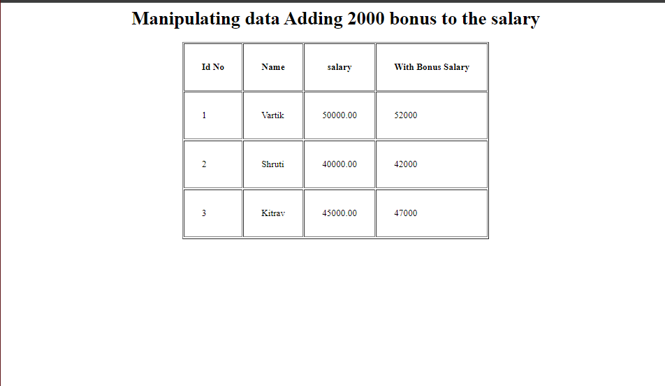

## Write a program to manipulate data and display all this information using table format


## Code

### index.php


```php
<?php

$conn = mysqli_connect("localhost", "root", "", "vartikdb");

if (!$conn) {
    echo "Error connecting to database";
}

$query = "SELECT * from emp";

$result = mysqli_query($conn, $query);

?>
<html lang="en">

<body>
    <center>
        <h1>Manipulating data Adding 2000 bonus to the salary</h1>
        <table border="2" cellpadding="30px">
            <th>Id No</th>
            <th>Name</th>
            <th>salary</th>
            <th>With Bonus Salary</th>


            <?php
            while ($row = mysqli_fetch_array($result)) {

                $salary = $row['salary'];
                $withBonus = $salary+2000;
                echo "<tr>";
                echo "<td>" . $row['emp_no']  . "</td>";
                echo "<td>" . $row['emp_name']  . "</td>";
                echo "<td>" .  $row['salary']  . "</td>";
                echo "<td>" .  $withBonus  . "</td>";
                echo "<tr>";
            }

            ?>

        </table>
    </center>
</body>

</html>


```

## Output

