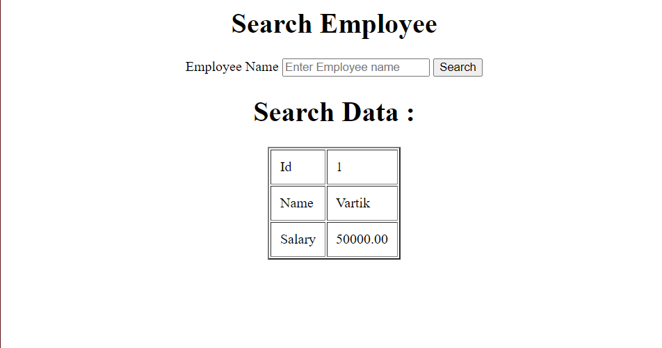

## Create form to search data 


## Code

### index.php


```php

<?php
$conn = mysqli_connect("localhost", "root", "", "vartikdb");

if (!$conn) {
    echo "Error connecting to database";
}

$result = null;
if(isset($_POST['search'])){
    $name = $_POST['name'];
    
    
    $query = "SELECT * FROM emp WHERE emp_name = '$name'";
    $result = mysqli_query($conn, $query);
}
?>

<html>
<body>
    <center>
    <h1>Search Employee</h1>

    <form action="" method="post">
        <label for="name">Employee Name</label>
        <input type="text" name="name" id="name" placeholder="Enter Employee name">

        <input type="submit" name="search" class="search" value="Search">
    </form>

    <?php
    
    if($result !== null && mysqli_num_rows($result) > 0) {
        echo "<h1>Search Data :</h1>";
        echo "<table border='2' cellpadding='10px'>";
        while($row = mysqli_fetch_array($result)){
            echo "<tr>";
            echo "<td>Id</td>";
            echo "<td>". $row['emp_no'] ."</td>";
            echo "</tr>";
            echo "<tr>";
            echo "<td>Name</td>";
            echo "<td>". $row['emp_name'] ."</td>";
            echo "</tr>";
            echo "<tr>";
            echo "<td>Salary</td>";
            echo "<td>". $row['salary'] ."</td>";
            echo "</tr>";
        }
        echo "</table>";
    }  else {
        echo "No Results Found";
    }
    ?>
    </center>
</body>
</html>


```

## Output

