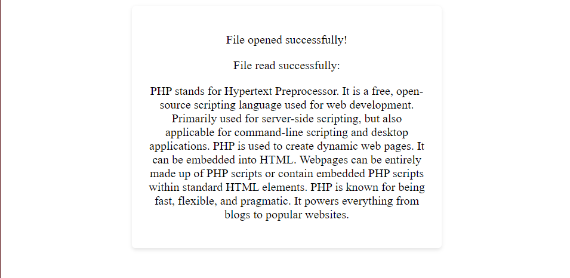

## Open and Read a file


## Code

### index.php


```php
<!DOCTYPE html>
<html lang="en">
<head>
    <meta charset="UTF-8">
    <meta name="viewport" content="width=device-width, initial-scale=1.0">
    <title>File Handling</title>
    <style>
     
        .container {
            width: 50%;
            background-color: #fff;
            padding: 20px;
            border-radius: 5px;
            box-shadow: 0 2px 5px rgba(0, 0, 0, 0.1);
        }
    </style>
</head>
<body>
<center>
<div class="container">
    <?php

    $file_path = "example.txt";

    $file = fopen($file_path, "r") or die("Unable to open file!");

    echo "<p>File opened successfully!</p>";

    $file_content = fread($file, filesize($file_path));

    fclose($file);

    echo "<p>File read successfully:</p>";
    echo "<p>$file_content</p>";

    ?>
</div>
</center>
</body>
</html>


```

### example.txt

```txt
PHP stands for Hypertext Preprocessor.
It is a free, open-source scripting language used for web development.
Primarily used for server-side scripting, but also applicable for command-line scripting and desktop applications.
PHP is used to create dynamic web pages.
It can be embedded into HTML.
Webpages can be entirely made up of PHP scripts or contain embedded PHP scripts within standard HTML elements.
PHP is known for being fast, flexible, and pragmatic.
It powers everything from blogs to popular websites.

```


## Output

